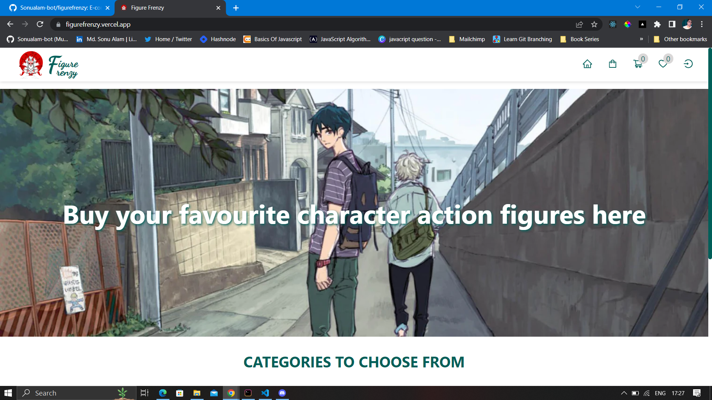
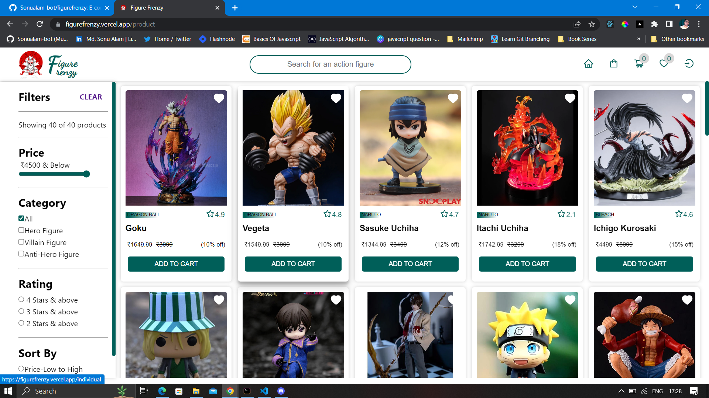

# Figure Frenzy

Figure Frenzy is an anime e-commerce website that caters to anime enthusiasts and collectors. It offers a wide range of anime merchandise, with a special focus on figurines. The website aims to provide a convenient and enjoyable shopping experience for anime fans who are passionate about collecting and displaying their favorite characters.

---

## Preview




## Tech Stack

- **FrontEnd :** ***React.js, HTML, CSS***
- **BackEnd :**  ***MockBee***
- **Payment Integration :** ***Razorpay***
- **Deployement :** ***Vercel***
- **Other Libraries :** ***React Router v6, Axios, JSON web token, React Context API, useReducer,React Icons, React Toastify, etc.***


## Features

- Authentication
  - Login
  - Logout
  - Signup
- Product Listing Page
- Filter Products By
  - Category
  - Discount
  - Price
  - Rating
  - sort by price
- Cart Management
   - Add To Cart
   - Remove From Cart 
- Wishlist Management
   - Add to wishlist
   - Remove from wishlist
- Search By 
    - Product Name
- Single Product Page
- Address Management
- Loading & Alerts
- User Profile Page
- Checkout
- Order Summary
- Order History
- Apply Coupons
- Payment Intergration
- Responsive


## Run Locally

Clone the project

```bash
  git clone https://github.com/Sonualam-bot/figurefrenzy.git
```

Go to project directory

```bash
  cd figurefrenzy
```

Install dependencies
```bash
  npn install
```

Start the Server
```bash
  npm start
```

## Authors

-[@sonualam-bot](https://www.github.com/sonualam-bot)
